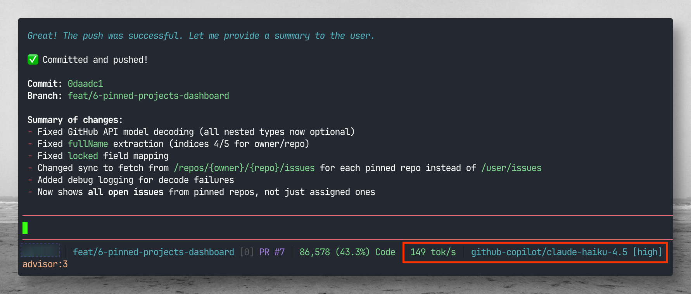
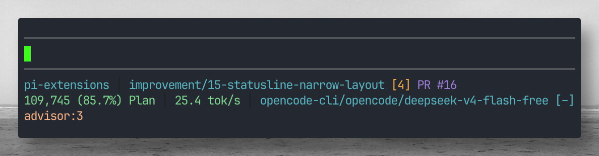
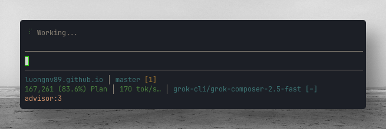
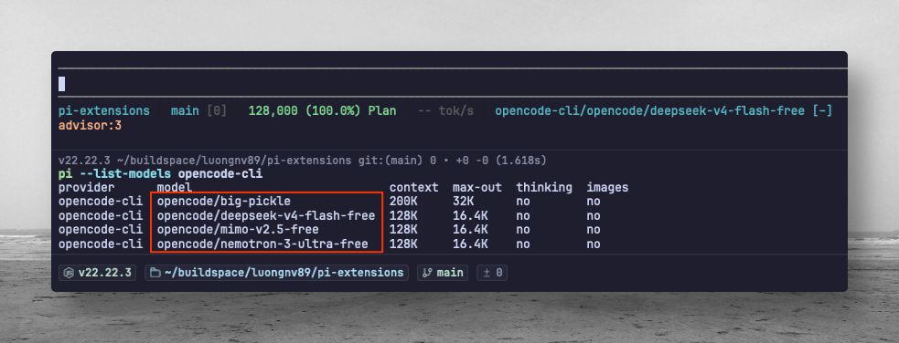
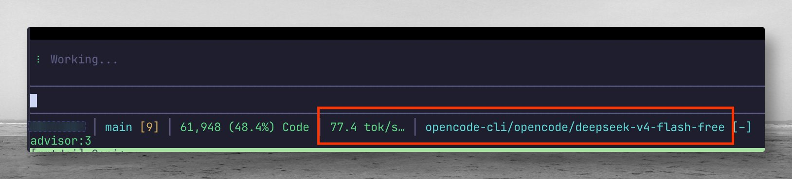
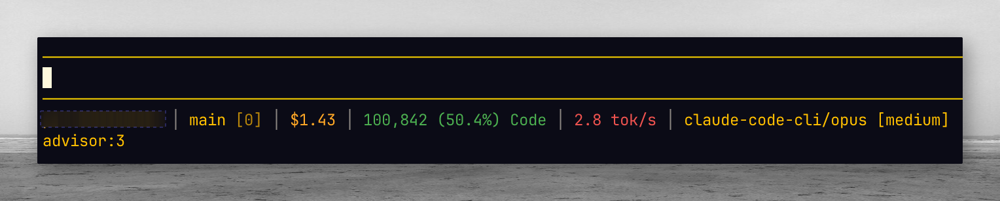
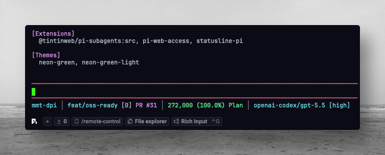
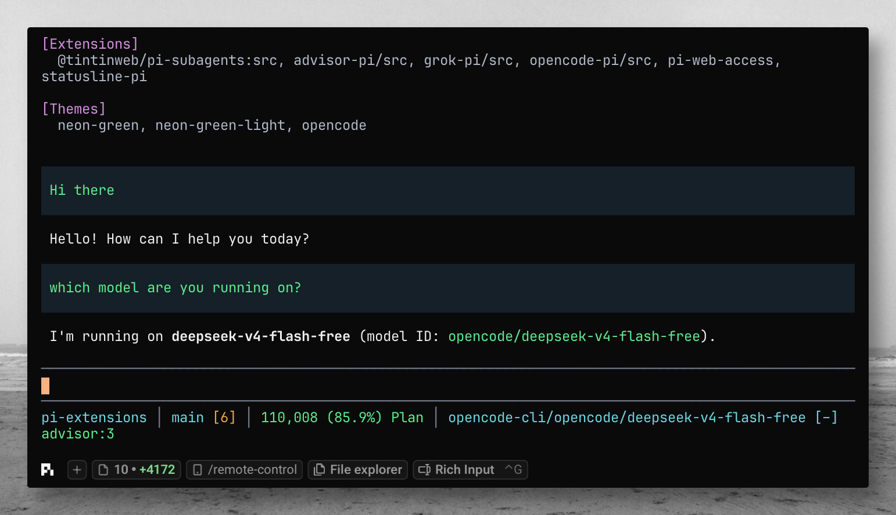

# Pi Extensions & Themes

[](LICENSE)
[](https://github.com/luongnv89/pi-extensions/releases)
[](docs/DEVELOPMENT.md)

A curated collection of extensions and themes for [Pi Coding Agent](https://github.com/earendil-works/pi-coding-agent). Share your Pi setup across different environments with ease.

## Screenshots

| | |
|:---:|:---:|
| **statusline-pi** — git, cost, CPU/MEM, context zone, tok/s | **statusline-pi** — wrapped footer on a narrow terminal |
|  |  |
| **grok-pi** — Composer 2.5 via `grok-cli` | **opencode-pi** — free OpenCode models in `/model` |
|  |  |
| **opencode-pi** — DeepSeek flash in session | **claude-code-pi** — `claude-code-cli` provider |
|  |  |
| **advisor-pi** — strategic `advisor` tool | **Codex** — example Pi session (built-in provider) |
|  |  |

More assets live in [`assets/`](assets/) (e.g. `statusline-pi-gpt-5-mini-195toks.png`, `pi-nvidia-kimi-2.6.png`).

## Key Features

- **statusline-pi** — Compact custom footer showing current directory, git branch, changed files, GitHub PR number, remaining context window (tokens + percentage), context zone, average model response speed, and active provider/model.
- **advisor-pi** — Advisor-style strategic guidance tool that lets the executor consult a configured higher-capability model during complex workflows.
- **claude-code-pi** — Bridge Claude Code CLI model aliases into Pi strictly through local `claude -p` calls, with no SDK/API fallback path.
- **apple-fm-pi** — Bridge Apple Foundation Models (`fm` CLI: on-device `system`, `pcc`) into Pi with auto-start `fm serve` and `/apple-fm-pi` commands.
- **grok-pi** — Bridge Grok CLI session models (Composer 2.5, Grok Build) into Pi via `grok-cli` and `~/.grok/auth.json`.
- **opencode-pi** — Bridge local OpenCode CLI free models into Pi without OpenCode login, with OpenCode tools disabled and Pi tool calls prompt-bridged back into Pi.
- **pi-delegator** — Agent skill for delegating approved tasks to a monitored Pi subprocess, preferring free `opencode-cli` models and reporting session metrics.
- **Neon Green themes** — Futuristic dark (`neon-green`) and light (`neon-green-light`) themes with neon green, cyan, and magenta accents.
- **npm packages** — Several extensions publish to npm; install with Pi’s package manager (`pi install npm:<name>`).
- **One-command install** — Interactive or automated (`--auto`) installer via a single curl pipe (full repo: all extensions, themes, skills).
- **npm convenience scripts** — `install-all`, `install-extensions`, `install-themes`, `install-skills` for local development from a clone.
- **Auto-discovery** — Themes and skills are automatically picked up from Pi's agent directories.

## Quick Start

Use **npm packages** when you only need specific extensions. Use the **repo installer** for everything (themes, skills, extensions not on npm, or a full mirror of this repo).

### Install extensions from npm (recommended for individual packages)

Pi registers npm packages in `~/.pi/agent/settings.json` and installs them under `~/.pi/agent/npm/`. Use `pi install`, not plain `npm install`.

```bash
# One extension
pi install npm:statusline-pi
pi install npm:advisor-pi
pi install npm:grok-pi
pi install npm:opencode-pi
pi install npm:model-debugger

# Pin a version
pi install npm:opencode-pi@1.1.0

# Project-local (writes to .pi/settings.json in the current project)
pi install -l npm:statusline-pi
```

| npm package | What it provides |
|-------------|------------------|
| [`statusline-pi`](https://www.npmjs.com/package/statusline-pi) | Custom footer (git, PR, context, speed, cost, CPU/MEM) |
| [`advisor-pi`](https://www.npmjs.com/package/advisor-pi) | `advisor` tool + `/advisor-pi` |
| [`grok-pi`](https://www.npmjs.com/package/grok-pi) | `grok-cli` provider |
| [`opencode-pi`](https://www.npmjs.com/package/opencode-pi) | `opencode-cli` free models |
| [`model-debugger`](https://www.npmjs.com/package/model-debugger) | Model request logging to `~/.pi/agent/logs/` |

**Not on npm yet** (install from repo below): `apple-fm-pi`, `claude-code-pi`.

Try without installing (current session only):

```bash
pi -e npm:advisor-pi
```

List and update installed packages:

```bash
pi list
pi update --extensions
pi remove npm:advisor-pi
```

Reload Pi after changes — type `/reload` (or restart Pi).

**Gallery:** Published packages with the `pi-package` keyword appear on [pi.dev/packages](https://pi.dev/packages). See [docs/DEVELOPMENT.md](docs/DEVELOPMENT.md#listing-on-pidevpackages) for metadata (`pi.image`, republish checklist).

### One-liner install (full collection from GitHub)

```bash
curl -fsSL https://raw.githubusercontent.com/luongnv89/pi-extensions/main/install.sh | bash -s -- --auto
```

### From cloned repo

```bash
git clone https://github.com/luongnv89/pi-extensions ~/.pi/pi-extensions
~/.pi/pi-extensions/install.sh --auto
```

### Interactive install (legacy)

```bash
~/.pi/pi-extensions/install.sh
```

Reload Pi after installation — open Pi and type `/reload`.

## Usage

### statusline-pi

`statusline-pi` replaces Pi's default footer with a compact project statusline.


```
current-dir │ branch [changed files] PR #x │ remaining context tokens (percentage) context zone │ average response speed │ provider/model
```

Example:

```
pi-extensions │ main [2] PR #12 │ 840,037 (84.0%) Plan │ 42.5 tok/s │ openai-codex/gpt-5.5
```

**Git section** — groups all git-related status:
- Current branch name
- Number of changed files from `git status --porcelain`
- Related GitHub PR number (when `gh pr view` resolves one)

**Context section** — remaining context window as exact tokens plus percentage, followed by the active zone:

```
840,037 (84.0%) Plan
```

Zone coloring:
- **Plan** / **Code** — success color
- **Dump** — warning color
- **ExDump** / **Dead** — error color

**Average response speed** — approximate model output speed for the current model/thinking context:

```
42.5 tok/s
```

The value averages completed assistant responses, includes the active response while streaming, and remains visible while idle.

**Commands:**

```
/statusline-pi       # Toggle the custom footer on/off
/statusline-refresh  # Force refresh git and PR data
```

### claude-code-pi

`claude-code-pi` registers the **`claude-code-cli`** provider so Pi can use Claude Code CLI model aliases such as `sonnet`, `opus`, and `fable`. Every model turn spawns the local `claude -p` command with the selected model; there is no Anthropic SDK, HTTP API, or built-in provider fallback.


Full setup: [extensions/claude-code-pi/README.md](extensions/claude-code-pi/README.md)

```bash
pi --provider claude-code-cli --model sonnet
```

**Commands:** `/claude-code-pi status`, `/claude-code-pi models`, `/claude-code-pi test`, `/claude-code-pi help`

### apple-fm-pi

`apple-fm-pi` registers **`apple-fm`** so Pi can use Apple's **`fm`** CLI models (**`system`** on-device, **`pcc`** when available). It auto-starts `fm serve` and replaces a manual `models.json` entry.

Full setup: [extensions/apple-fm-pi/README.md](extensions/apple-fm-pi/README.md)

```bash
pi --provider apple-fm --model system
```

**Commands:** `/apple-fm-pi status`, `/apple-fm-pi start`, `/apple-fm-pi models`, `/apple-fm-pi context`, `/apple-fm-pi test`, `/apple-fm-pi help`

### grok-pi

`grok-pi` registers the **`grok-cli`** provider so Pi can use the same models as the Grok CLI (including **Composer 2.5** as `grok-composer-2.5-fast`). Authenticate with `grok login`, then pick `grok-cli` in `/model`.


Full setup: [extensions/grok-pi/README.md](extensions/grok-pi/README.md)

```bash
pi --provider grok-cli --model grok-composer-2.5-fast
```

**Commands:** `/grok-pi status`, `/grok-pi help`

### opencode-pi

`opencode-pi` registers the **`opencode-cli`** provider so Pi can use free models exposed by the local OpenCode CLI, without `opencode auth login`.




Full setup: [extensions/opencode-pi/README.md](extensions/opencode-pi/README.md)

```bash
pi --provider opencode-cli --model opencode/deepseek-v4-flash-free
```

**Commands:** `/opencode-pi status`, `/opencode-pi models`, `/opencode-pi test`, `/opencode-pi help`

### advisor-pi

`advisor-pi` registers an `advisor` tool for strategic planning and course correction.
The executor model can ask a configured advisor model for guidance while keeping
file changes under the executor's control.


**Commands:**

```
/advisor-pi status
/advisor-pi enable
/advisor-pi disable
/advisor-pi model <provider>/<model>
/advisor-pi max-uses <number>
/advisor-pi cache <none|short|long>
/advisor-pi reset
```

**Operational notes:**

- Each advisor consultation is a separate model call and may add cost.
- Executor streaming pauses while the advisor model responds.
- Cache preferences are passed through where providers support them.
- The advisor has no tools; it only returns strategic guidance.

### pi-delegator

`pi-delegator` is an agent skill that lets a main AI agent delegate a clear,
approved task to a separate Pi process. It starts by checking available Pi models,
prefers free `opencode-cli` models by default, saves a reusable default model,
streams progress, and reports duration/token/cost metrics when Pi exposes them.

```bash
python3 ~/.pi/agent/skills/pi-delegator/scripts/pi_delegate.py models --prefer-free
```

Use the skill from Pi as `/skill:pi-delegator`, or let Pi auto-load it when you
ask to delegate work to a separate Pi instance.

### Themes

Themes are automatically discovered from `~/.pi/agent/themes/`.

Available themes:
- `neon-green` — Futuristic dark theme
- `neon-green-light` — Softer light variant

Manual install:

```bash
cp ~/.pi/pi-extensions/themes/neon-green.json ~/.pi/agent/themes/
cp ~/.pi/pi-extensions/themes/neon-green-light.json ~/.pi/agent/themes/
```

Select a theme from Pi's `/settings`, then reload if needed.

## Configuration

### Install Flags

| Flag              | Effect                                         |
|-------------------|-------------------------------------------------|
| `--auto`          | Skip prompts, install everything automatically  |
| `--keep`          | Keep the cloned repo after installation         |
| `--dry-run`       | Show what would be installed without copying    |
| `--repo-url URL`  | Use a custom repo URL (default: GitHub)         |
| `--branch BRANCH` | Use a custom branch (default: `main`)           |

## Project Structure

```text
pi-extensions/
├── README.md
├── LICENSE
├── CONTRIBUTING.md
├── CODE_OF_CONDUCT.md
├── SECURITY.md
├── install.sh
├── package.json
├── .github/
│   ├── ISSUE_TEMPLATE/
│   │   ├── bug_report.md
│   │   └── feature_request.md
│   └── PULL_REQUEST_TEMPLATE.md
├── docs/
│   ├── DEVELOPMENT.md
│   └── CHANGELOG.md
├── extensions/
│   ├── advisor-pi/
│   │   ├── package.json
│   │   ├── src/index.ts
│   │   └── README.md
│   ├── grok-pi/
│   │   ├── package.json
│   │   ├── src/index.ts
│   │   └── README.md
│   ├── opencode-pi/
│   │   ├── package.json
│   │   ├── src/index.ts
│   │   └── README.md
│   └── statusline-pi/
│       ├── package.json
│       ├── src/index.ts
│       └── README.md
├── skills/
│   └── pi-delegator/
│       ├── SKILL.md
│       ├── scripts/pi_delegate.py
│       └── references/
└── themes/
    ├── neon-green.json
    └── neon-green-light.json
```

## Updating

```bash
cd ~/.pi/pi-extensions
git pull origin main
~/.pi/pi-extensions/install.sh --auto
```

Then run `/reload` in Pi.

## Documentation

- [Contributing Guide](CONTRIBUTING.md) — how to add extensions, themes, and submit changes
- [Developer Guide](docs/DEVELOPMENT.md) — architecture, extension API, theme schema, npm scripts
- [Changelog](docs/CHANGELOG.md) — release history and planned features
- [Security Policy](SECURITY.md) — how to report vulnerabilities

## Related Publications

> Coming soon.

## License

MIT — see [LICENSE](LICENSE) for details.
