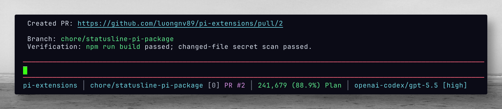

# statusline-pi



Compact project statusline footer for Pi.

Format:

```text
current-dir │ branch [changed files] PR #x │ estimated session cost │ CPU % · MEM % │ remaining context tokens (percentage) context zone │ average response speed │ provider/model
```

Example:

```text
pi-extensions │ main [2] PR #12 │ $0.18 │ CPU 42% · MEM 68% │ 840,037 (84.0%) Plan │ 42.5 tok/s │ openai-codex/gpt-5.5
```

## Behavior

- Installs as a Pi extension and enables automatically on session start.
- Replaces Pi's default footer with a compact responsive statusline.
- Uses one line when the terminal is wide enough, then wraps into multiple width-safe
  lines on narrow terminals so long branch names do not hide context, speed, or model details.
- Refreshes git change count and host CPU/memory usage every 5 seconds.
- Shows **CPU** and **MEM** utilization for the local machine (`CPU 42% · MEM 68%`). CPU is derived from `os.cpus()` time deltas (omitted until the second sample). Memory is `(total - free) / total`. Colors follow the same thresholds as other indicators: default success, warning at ≥85%, error at ≥95%.
- Shows average model response speed as output tokens per second (`tok/s`) across completed assistant responses.
- Shows an **estimated accumulated session cost** in USD, summed from each assistant response's token usage (`input`, `output`, `cache-read`, `cache-write`) and the active model's per-million token rates from Pi's model catalog (aligned with [pi.dev/models](https://pi.dev/models)). This is an estimate only—actual billing may differ by provider, discounts, or OAuth subscriptions.
- Updates the cost after each assistant response and when you switch models; omits the cost segment when the active model has no pricing, and displays `cost ?` when usage was reported without a computable price.
- Includes the active assistant response in the average while it is streaming, then keeps the completed average visible while idle.
- Checks for a GitHub PR associated with the current branch every 60 seconds using `gh pr view`.
- Omits the PR segment when `gh` is unavailable or the branch has no PR.

## Commands

- `/statusline-pi` — toggle the custom footer on/off.
- `/statusline-refresh` — force refresh git and PR data.

## Install

From the repo root:

```bash
cp -r extensions/statusline-pi ~/.pi/agent/extensions/
```

Then run `/reload` in Pi.
