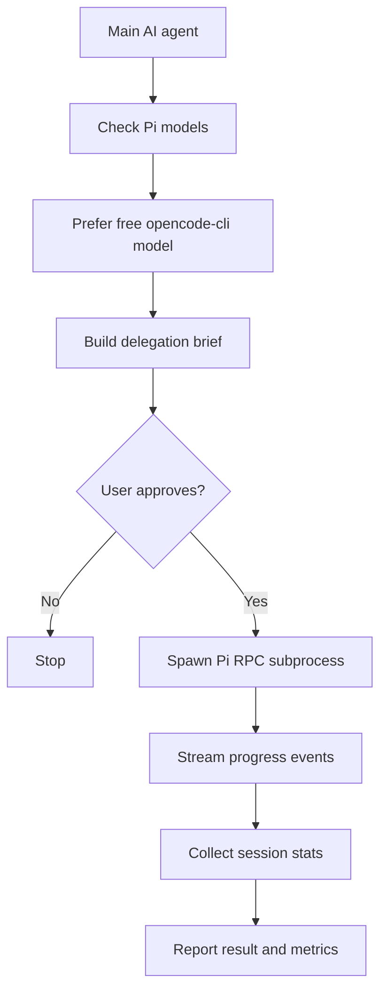

<!-- AI_SKIP: Human-facing catalog README. Agents should read ../SKILL.md instead. -->

# Pi Delegator

Pi Delegator is an agent skill for safely handing a clearly scoped task from one
AI agent to a separate Pi subprocess.

## Highlights

- Checks available Pi models before running.
- Prefers free `opencode-cli` models by default.
- Saves a default model in `~/.pi/agent/skills/pi-delegator/config.json`.
- Requires a clear task preview and explicit approval before execution.
- Streams Pi progress events in compact human-readable form.
- Reports duration, tokens, cost, tool calls, retries, compactions, and session
  path when Pi exposes them.

## When to use

| Use it for | Avoid it for |
| --- | --- |
| Delegating implementation tasks to Pi | Direct edits by the current agent |
| Running a separate monitored Pi session | CI/CD pipeline setup |
| Capturing metrics from a Pi run | Non-Pi coding agents |
| Free-model-first task execution | Unapproved background automation |

## How it works



## Helper script

```bash
python3 skills/pi-delegator/scripts/pi_delegate.py models --prefer-free
python3 skills/pi-delegator/scripts/pi_delegate.py configure \
  --model "opencode-cli/opencode/deepseek-v4-flash-free" \
  --thinking low
python3 skills/pi-delegator/scripts/pi_delegate.py run \
  --approved \
  --task-file /tmp/pi-task.md \
  --cwd "$PWD" \
  --complexity medium \
  --tools read,bash,edit,write
```

The `run` command refuses to start unless `--approved` is present, so the skill
can enforce an explicit approval gate.
